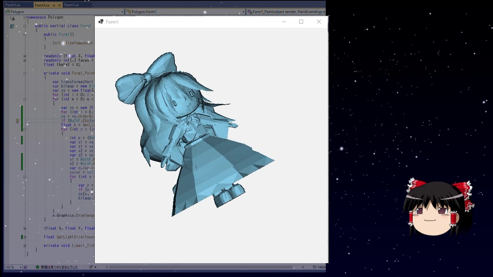

# 【ゆっくり解説】3Dグラフィックスの基礎 【プログラミング】
動画シリーズ [3Dグラフィックスの基礎](https://youtube.com/playlist?list=PLeSkrKyDEPCgeO49SiwWdutcKScdq-PwD&si=rHEoyirTiL_AfWDj) で解説しているコードです。

## 開発環境
これをインストールしていれば、本WebサイトのCodeボタンから「Open with Visual Studio」でソースコードを丸ごとダウンロード(クローン)出来ます。
- [Visual Studio 2022](https://visualstudio.microsoft.com/ja/downloads/)
　
## プロジェクトについて
Visual 3D_Explanation.slnを開き、Polygonプロジェクトをスタートアッププロジェクトに設定して実行すればプログラムが動きます。
- Polygon：第一回の完成品のプロジェクトです。
- GouraudShading：第二回の完成品のプロジェクトです。
- Texture：第三回及び第四回の完成品のプロジェクトです。
- Camera：第六回の完成品のプロジェクトです。
- 他はテスト用プロジェクトです。
